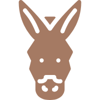

<div align="center">

</div>


# ArkPlotWpf


简单来说是一个~~这片大地~~“话剧剧本”生成器。


具体来说是一个使用.NET WPF框架，基于正则表达式的，明日方舟剧情文本生成器，可用来生成剧情的markdown/html文件。


## 设计初衷


edge浏览器“大声朗读”功能的TTS语音声音好听又富有情感。写ArkPlot就是想在打肉鸽的时候补剧情。目前用ArkPlot搭配大声朗读，我已经补了不少卡西米尔、莱塔尼亚、炎国、维多利亚……相关的剧情。


你可能会问，咋不去听萧然或者其他up主的？原因很简单，他们读的时候只有一个人，但是方舟剧情里常常有五六个NPC七嘴八舌的情况。


于是我找到了[Kengxxiao的《明日方舟》游戏数据 ](https://github.com/Kengxxiao/ArknightsGameData/tree/master)。量大管饱，按时CI。但是方舟剧情文本的txt文件是一种使用方括号的“html”，直接扔给“大声朗读”无异于给自己上刑。于是这个简陋的“parser”就诞生了。


## 主要功能


* 支持中日英韩四服务器剧情文本生成
* 随游戏更新自动获取新剧情~~只要Kengxxiao不Keng~~
* ~~粗暴~~处理游戏内原文本，可自定义tag及其处理用的正则表达式
* ~~简陋~~精美UI


<div align="center">

</br>

</div>

---
---
## 输出效果

### 默认输出html效果


### Typora 中使用 Autumns 主题的效果


## 使用说明


:warning:本程序基于 .Net 7.0 构建，运行前请保证[.Net 7.0 运行时](https://dotnet.microsoft.com/zh-cn/download/dotnet/7.0)已安装:warning:
1. 因为程序所有内容都来自GitHub仓库，所以在使用时请务必全程`科学上网`
2. 如果不出意外，选好活动名，点开始，一切便会好起来
3. 随游戏更新，《明日方舟》的AVG总是会添加新tag~~或者错别字~~。新tag在没有收入tags.json中的时候，相应的语句不会处理，直接写入生成文件，例如:假如明日方舟新出了一个立绘变形方式，取名characteraction，tags.json中没有收录这个tag，那么```[characteraction(name="middle",type="move",ypos=-50,fadetime=0.51)]```会直接写到生成的文件里，而不是写入```人物动作：移动```这样的中文缩写，~~耳朵要偶尔受刑~~
4. 如果上述情况出现，可以尝试点击软件中的“编辑Tags”对tag、替换文字及相应的正则表达式进行增删查改
5. assets/head.html 是用来调整输出html的样式的。默认使用[MarkdownPad2AutoCatalog](https://gitee.com/dr_cat/MarkdownPad2AutoCatalog)
6. assets/tail.html 是用来写一些用来处理的js脚本的。默认功能是给所有角色名染色
7. 如果出了意外，欢迎PR。~~俺随缘更新~~


以上。


## 开发说明


本项目使用net7.0，C#11，低版本可能一些语法特性无法支持。


## 项目用到的一些开源库


* 游戏数据：[Kengxxiao/ArknightsGameData: 《明日方舟》游戏数据 (github.com)](https://github.com/Kengxxiao/ArknightsGameData/tree/master)


* WPF 控件库：[HandyControl](https://github.com/HandyOrg/HandyControl) 


* C# JSON库：[Newtonsoft.Json](https://github.com/JamesNK/Newtonsoft.Json) 


* Markdown样式库：[MarkdownPad2AutoCatalog](https://gitee.com/cayxc/MarkdownPad2AutoCatalog)
